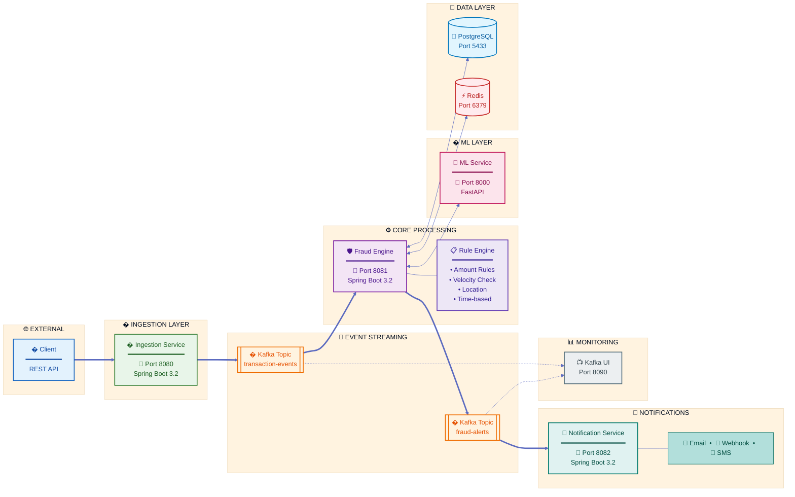
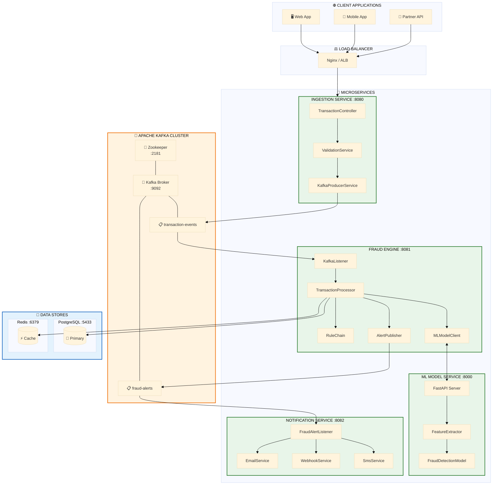
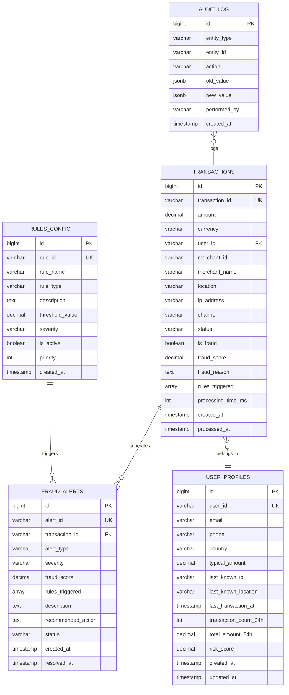
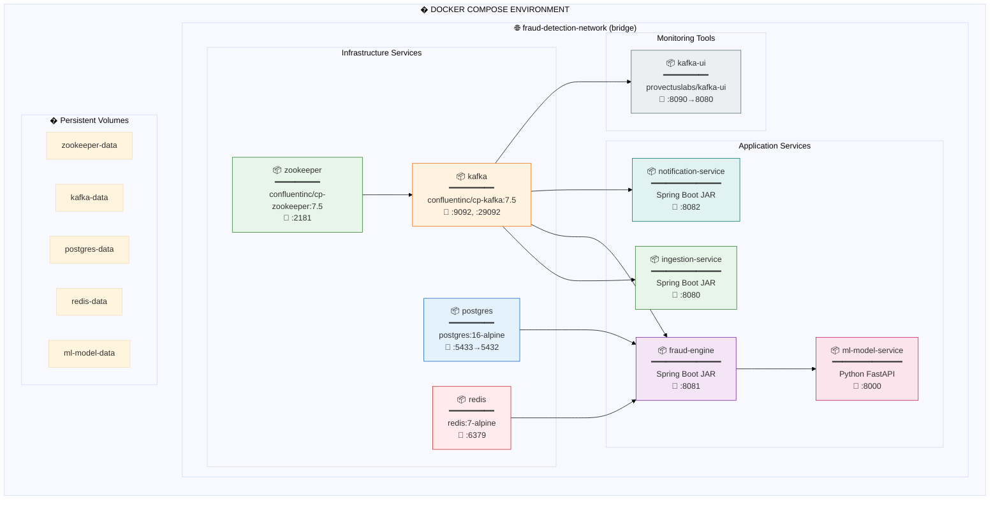
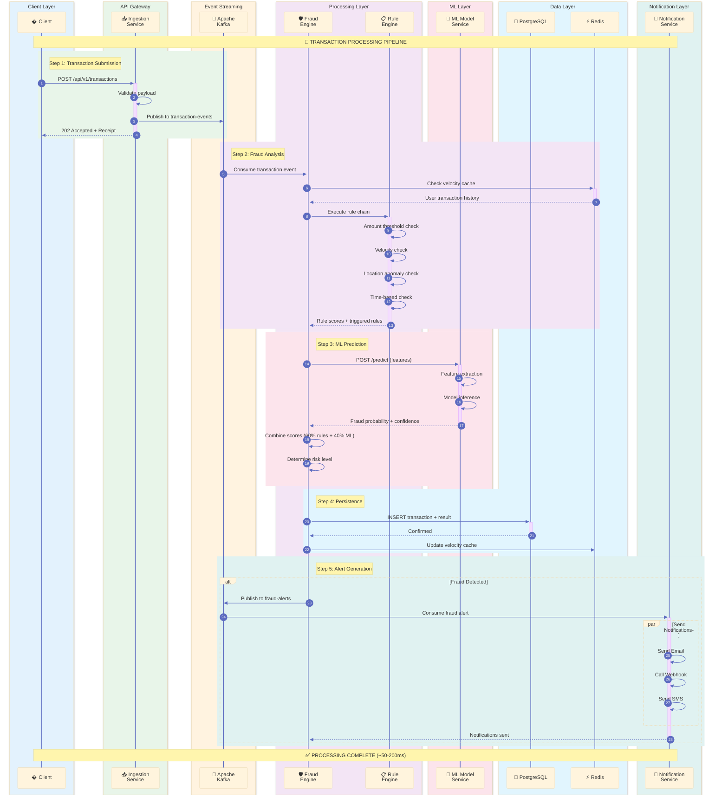
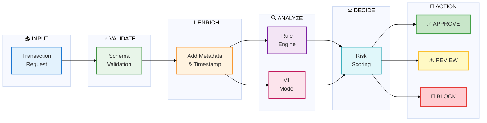

<div align="center">

# 🛡️ Real-Time Fraud Detection System

### Enterprise-Grade Event-Driven Fraud Detection Platform

**👨‍💻 Developed by [Bhushan Asati](https://github.com/bhushanasati25)**

[](https://openjdk.org/)
[](https://spring.io/projects/spring-boot)
[](https://kafka.apache.org/)
[](https://www.python.org/)
[](https://fastapi.tiangolo.com/)
[](https://www.postgresql.org/)
[](https://redis.io/)
[](https://www.docker.com/)
[](LICENSE)

---

**A production-ready, microservices-based fraud detection system that combines rule-based engines with machine learning models to detect fraudulent transactions in real-time.**

[Features](#-features) •
[Architecture](#-architecture) •
[Quick Start](#-quick-start) •
[API Documentation](#-api-documentation) •
[Configuration](#%EF%B8%8F-configuration)

</div>

---

## 📋 Table of Contents

- [Features](#-features)
- [Architecture](#-architecture)
- [Technology Stack](#-technology-stack)
- [Project Structure](#-project-structure)
- [Quick Start](#-quick-start)
- [API Documentation](#-api-documentation)
- [Fraud Detection Rules](#-fraud-detection-rules)
- [Machine Learning Model](#-machine-learning-model)
- [Configuration](#%EF%B8%8F-configuration)
- [Monitoring & Observability](#-monitoring--observability)
- [Testing](#-testing)
- [Troubleshooting](#-troubleshooting)
- [Contributing](#-contributing)
- [Author](#-author)
- [License](#-license)

---

## ✨ Features

<table>
<tr>
<td width="50%">

### 🚀 Core Capabilities

- **Real-Time Processing** - Sub-second transaction analysis
- **Hybrid Detection** - Rule engine + ML model scoring
- **Event-Driven Architecture** - Kafka-based async processing
- **Microservices Design** - Independently deployable services
- **High Availability** - Scalable and fault-tolerant

</td>
<td width="50%">

### 🔧 Technical Features

- **RESTful APIs** - OpenAPI/Swagger documented
- **Database Persistence** - PostgreSQL with optimized indexes
- **Caching Layer** - Redis for velocity checks
- **Containerized** - Docker & Docker Compose ready
- **Health Monitoring** - Spring Actuator endpoints

</td>
</tr>
</table>

### Key Highlights

| Feature | Description |
|---------|-------------|
| 🎯 **Multi-Rule Engine** | Configurable rules for amount thresholds, velocity checks, location anomalies, and time-based patterns |
| 🤖 **ML Integration** | Python-based ML model with fraud probability scoring and feature importance analysis |
| 📊 **Real-Time Alerts** | Instant fraud notifications via Email, Webhook, and SMS channels |
| 🔄 **Async Processing** | Non-blocking transaction ingestion with Kafka message queuing |
| 📈 **Audit Trail** | Complete transaction history with fraud scores and triggered rules |

---

## 🏗 Architecture

<div align="center">

### High-Level System Architecture

</div>

> **Enterprise-grade microservices architecture** combining rule-based fraud detection with machine learning for real-time transaction analysis.



---

<div align="center">

### 📐 Detailed Component Architecture

</div>



---

<div align="center">

### 🗄️ Database Schema

</div>



---

<div align="center">

### 🐳 Docker Deployment Architecture

</div>



---

<div align="center">

### 🔄 Transaction Processing Flow

</div>



---

<div align="center">

### 📊 Service Communication Matrix

</div>

| Source Service | Target Service | Protocol | Port | Topic/Endpoint |
|:--------------|:---------------|:---------|:-----|:---------------|
| Client | Ingestion Service | HTTP/REST | 8080 | `/api/v1/transactions` |
| Ingestion Service | Kafka | TCP | 9092 | `transaction-events` |
| Kafka | Fraud Engine | TCP | 9092 | `transaction-events` |
| Fraud Engine | ML Service | HTTP/REST | 8000 | `/predict` |
| Fraud Engine | PostgreSQL | TCP | 5432 | JDBC |
| Fraud Engine | Redis | TCP | 6379 | Redis Protocol |
| Fraud Engine | Kafka | TCP | 9092 | `fraud-alerts` |
| Kafka | Notification Service | TCP | 9092 | `fraud-alerts` |

---

<div align="center">

### 🎯 Processing Pipeline Overview

</div>



## 🛠 Technology Stack

<div align="center">

### Core Technologies

</div>

<table>
<tr>
<td align="center" width="20%">

<br><b>Backend Services</b>
<br><br>

<br>

<br>

<br>

<br>

</td>
<td align="center" width="20%">

<br><b>ML Service</b>
<br><br>

<br>

<br>

<br>

<br>

</td>
<td align="center" width="20%">

<br><b>Message Broker</b>
<br><br>

<br>

<br>

<br>

</td>
<td align="center" width="20%">

<br><b>Data Storage</b>
<br><br>

<br>

<br>

<br>

</td>
<td align="center" width="20%">

<br><b>DevOps</b>
<br><br>

<br>

<br>

<br>

</td>
</tr>
</table>

<div align="center">

### 📦 Dependencies & Versions

</div>

| Category | Component | Version | Purpose | License |
|:--------:|:----------|:-------:|:--------|:-------:|
| 🟢 **Core** | Spring Boot | `3.2.1` | Application framework | Apache 2.0 |
| 🟢 **Core** | Spring Kafka | `3.1.1` | Kafka messaging integration | Apache 2.0 |
| 🟢 **Core** | Spring Data JPA | `3.2.1` | Database abstraction layer | Apache 2.0 |
| 🔵 **Database** | PostgreSQL Driver | `42.7.1` | JDBC database connectivity | BSD-2-Clause |
| 🔵 **Database** | HikariCP | `5.1.0` | High-performance connection pool | Apache 2.0 |
| 🔴 **Cache** | Jedis | `5.1.0` | Redis Java client | MIT |
| 🟣 **API** | SpringDoc OpenAPI | `2.3.0` | API documentation (Swagger) | Apache 2.0 |
| 🟣 **API** | Jackson | `2.16.1` | JSON serialization | Apache 2.0 |
| 🟡 **Tooling** | Lombok | `1.18.30` | Boilerplate code reduction | MIT |
| 🟡 **Tooling** | MapStruct | `1.5.5` | Type-safe DTO mapping | Apache 2.0 |
| 📊 **Metrics** | Micrometer | `1.12.1` | Application metrics & monitoring | Apache 2.0 |
| 🐍 **Python** | FastAPI | `0.104+` | Async REST API framework | MIT |
| 🐍 **Python** | Scikit-learn | `1.3+` | Machine learning library | BSD-3-Clause |
| 🐍 **Python** | Pydantic | `2.5+` | Data validation | MIT |

<div align="center">

### 🏷️ Version Compatibility Matrix

</div>

```
┌─────────────────────────────────────────────────────────────────────────┐
│                        TECHNOLOGY VERSIONS                               │
├─────────────────────────────────────────────────────────────────────────┤
│                                                                          │
│   Java ══════════════════════╗                                          │
│        17 LTS                ║                                          │
│                              ║                                          │
│   Spring Boot ═══════════════╬═══════════════════ Spring Ecosystem      │
│           3.2.1              ║        │                                 │
│                              ║        ├── Spring Kafka 3.1.1            │
│   Python ════════════════════╣        ├── Spring Data JPA 3.2.1         │
│       3.11                   ║        └── Spring Security 6.2.1         │
│                              ║                                          │
│   Apache Kafka ══════════════╣                                          │
│          7.5.0 (Confluent)   ║                                          │
│                              ║                                          │
│   PostgreSQL ════════════════╣                                          │
│          16.x                ║                                          │
│                              ║                                          │
│   Redis ═════════════════════╝                                          │
│      7.x                                                                 │
│                                                                          │
└─────────────────────────────────────────────────────────────────────────┘
```

---

## 📁 Project Structure

```
Real-Time-Fraud-Detection-Service/
├── 📄 docker-compose.yml           # Container orchestration
├── 📄 pom.xml                      # Parent Maven POM (multi-module)
├── 📄 mvnw                         # Maven wrapper
├── 📄 README.md                    # Project documentation
│
├── 📁 init-scripts/                # Database initialization
│   └── 01-init.sql                 # Schema, tables, indexes, seed data
│
├── 📁 common-libs/                 # Shared library module
│   └── src/main/java/com/fraud/common/
│       ├── dto/                    # Data Transfer Objects
│       │   ├── TransactionEvent.java
│       │   ├── FraudAlert.java
│       │   ├── FraudResult.java
│       │   ├── MLScoreRequest.java
│       │   └── MLScoreResponse.java
│       ├── exception/              # Custom exceptions
│       ├── utils/                  # Utility classes
│       │   ├── JsonUtils.java
│       │   └── DateTimeUtils.java
│       └── constants/              # Constants & enums
│           └── KafkaConstants.java
│
├── 📁 ingestion-service/           # Transaction API Gateway
│   ├── Dockerfile
│   └── src/main/java/com/fraud/ingestion/
│       ├── controller/             # REST controllers
│       │   └── TransactionController.java
│       ├── service/                # Business logic
│       │   └── KafkaProducerService.java
│       └── config/                 # Configuration classes
│
├── 📁 fraud-engine/                # Core Fraud Detection
│   ├── Dockerfile
│   └── src/main/java/com/fraud/engine/
│       ├── rules/                  # Rule implementations
│       │   ├── Rule.java           # Rule interface
│       │   ├── RuleChain.java      # Rule orchestrator
│       │   ├── AmountThresholdRule.java
│       │   ├── VelocityRule.java
│       │   ├── LocationAnomalyRule.java
│       │   └── TimeAnomalyRule.java
│       ├── processor/              # Transaction processor
│       │   └── TransactionProcessor.java
│       ├── model/                  # ML client
│       │   └── MLModelClient.java
│       ├── entity/                 # JPA entities
│       │   ├── Transaction.java
│       │   └── UserProfile.java
│       ├── repository/             # Data access layer
│       └── listener/               # Kafka consumers
│
├── 📁 notification-service/        # Alert Notification
│   ├── Dockerfile
│   └── src/main/java/com/fraud/notification/
│       ├── listener/               # Kafka consumers
│       │   └── FraudAlertListener.java
│       └── service/                # Notification channels
│           ├── EmailService.java
│           ├── WebhookService.java
│           └── SmsService.java
│
└── 📁 ml-model-service/            # Python ML Service
    ├── Dockerfile
    ├── requirements.txt            # Python dependencies
    ├── app.py                      # FastAPI application
    ├── model.py                    # Fraud detection model
    └── train_model.py              # Model training script
```

---

## 🚀 Quick Start

### Prerequisites

Ensure you have the following installed:

| Tool | Version | Download |
|------|---------|----------|
| Docker | 20.10+ | [Get Docker](https://docs.docker.com/get-docker/) |
| Docker Compose | 2.0+ | Included with Docker Desktop |
| Git | Latest | [Get Git](https://git-scm.com/) |

> **Note:** Java 17+ and Maven 3.8+ are only required for local development without Docker.

### Installation

1. **Clone the repository**
   ```bash
   git clone https://github.com/bhushanasati25/Real-Time-Fraud-Detection-Service.git
   cd Real-Time-Fraud-Detection-Service
   ```

2. **Start all services with Docker Compose**
   ```bash
   docker-compose up -d --build
   ```

3. **Verify all services are running**
   ```bash
   docker-compose ps
   ```

   Expected output:
   ```
   NAME                   STATUS          PORTS
   fraud-engine           Up (healthy)    0.0.0.0:8081->8081/tcp
   ingestion-service      Up (healthy)    0.0.0.0:8080->8080/tcp
   kafka                  Up (healthy)    0.0.0.0:9092->9092/tcp
   kafka-ui               Up              0.0.0.0:8090->8080/tcp
   ml-model-service       Up (healthy)    0.0.0.0:8000->8000/tcp
   notification-service   Up (healthy)    0.0.0.0:8082->8082/tcp
   postgres               Up (healthy)    0.0.0.0:5433->5432/tcp
   redis                  Up (healthy)    0.0.0.0:6379->6379/tcp
   zookeeper              Up (healthy)    0.0.0.0:2181->2181/tcp
   ```

4. **Test the API**
   ```bash
   curl -X POST http://localhost:8080/api/v1/transactions \
     -H "Content-Type: application/json" \
     -d '{
       "transactionId": "TXN-TEST-001",
       "amount": 15000.00,
       "userId": "USER123",
       "merchantId": "MERCH456",
       "merchantName": "Electronics Store",
       "location": "New York",
       "ipAddress": "192.168.1.1",
       "channel": "ONLINE",
       "timestamp": "2024-12-18T21:00:00.000Z"
     }'
   ```

   Expected response:
   ```json
   {
     "success": true,
     "statusCode": 202,
     "message": "Transaction accepted for fraud detection processing",
     "data": {
       "transactionId": "TXN-TEST-001",
       "amount": 15000.00,
       ...
     }
   }
   ```

### Stopping the Services

```bash
# Stop all services
docker-compose down

# Stop and remove volumes (clean slate)
docker-compose down -v
```

---

## 📚 API Documentation

### Service Endpoints

| Service | Port | Swagger UI | Health Check |
|---------|------|------------|--------------|
| Ingestion Service | 8080 | [/swagger-ui.html](http://localhost:8080/swagger-ui.html) | [/actuator/health](http://localhost:8080/actuator/health) |
| Fraud Engine | 8081 | - | [/actuator/health](http://localhost:8081/actuator/health) |
| Notification Service | 8082 | - | [/actuator/health](http://localhost:8082/actuator/health) |
| ML Model Service | 8000 | [/docs](http://localhost:8000/docs) | [/health](http://localhost:8000/health) |
| Kafka UI | 8090 | [Dashboard](http://localhost:8090) | - |

### Ingestion Service API

#### Submit Transaction

```http
POST /api/v1/transactions
Content-Type: application/json
```

**Request Body:**

```json
{
  "transactionId": "TXN-2024-001",
  "amount": 1500.00,
  "currency": "USD",
  "userId": "USER-12345",
  "merchantId": "MERCH-789",
  "merchantName": "Amazon",
  "merchantCategory": "RETAIL",
  "location": "New York, USA",
  "latitude": 40.7128,
  "longitude": -74.0060,
  "ipAddress": "192.168.1.100",
  "deviceId": "DEVICE-ABC123",
  "cardType": "VISA",
  "cardLastFour": "4242",
  "transactionType": "PURCHASE",
  "channel": "ONLINE",
  "timestamp": "2024-12-18T15:30:00.000Z"
}
```

**Response (202 Accepted):**

```json
{
  "success": true,
  "statusCode": 202,
  "message": "Transaction accepted for fraud detection processing",
  "data": {
    "transactionId": "TXN-2024-001",
    "amount": 1500.00,
    "receivedAt": "2024-12-18T15:30:05.123Z",
    "sourceSystem": "ingestion-service"
  },
  "timestamp": "2024-12-18T15:30:05.123Z"
}
```

#### Submit Batch Transactions

```http
POST /api/v1/transactions/batch
Content-Type: application/json
```

#### Async Transaction Submission

```http
POST /api/v1/transactions/async
Content-Type: application/json
```

### ML Model Service API

#### Get Fraud Prediction

```http
POST /predict
Content-Type: application/json
```

**Request Body:**

```json
{
  "transactionId": "TXN-2024-001",
  "amount": 15000.00,
  "hourOfDay": 3,
  "dayOfWeek": 2,
  "isWeekend": false,
  "isNightTime": true,
  "transactionCountLast24h": 5,
  "totalAmountLast24h": 25000.00,
  "isNewDevice": true,
  "isNewLocation": true,
  "isNewMerchant": false
}
```

**Response:**

```json
{
  "transactionId": "TXN-2024-001",
  "fraudProbability": 0.7823,
  "prediction": "FRAUD",
  "isFraud": true,
  "confidence": 0.8456,
  "modelName": "FraudDetector",
  "modelVersion": "1.0.0",
  "processingTimeMs": 12,
  "threshold": 0.5,
  "topFeatures": [
    {"featureName": "amount", "importance": 0.35, "value": 15000.0},
    {"featureName": "is_night_time", "importance": 0.25, "value": 1.0}
  ]
}
```

---

## 🔍 Fraud Detection Rules

The system implements a configurable rule engine with the following built-in rules:

### Rule Definitions

| Rule ID | Name | Type | Condition | Score | Severity |
|---------|------|------|-----------|-------|----------|
| `RULE_001` | High Amount Threshold | AMOUNT | Amount > $10,000 | 0.5 | HIGH |
| `RULE_002` | Very High Amount | AMOUNT | Amount > $50,000 | 0.8 | CRITICAL |
| `RULE_003` | Velocity - Count | VELOCITY | >10 transactions/hour | 0.6 | MEDIUM |
| `RULE_004` | Velocity - Amount | VELOCITY | 24h total > $25,000 | 0.7 | HIGH |
| `RULE_005` | Location Anomaly | LOCATION | Different from last known | 0.4 | MEDIUM |
| `RULE_006` | IP Address Change | IP | Significant IP change | 0.3 | LOW |
| `RULE_007` | Night-time Transaction | TIME | Between 1 AM - 5 AM | 0.2 | LOW |
| `RULE_008` | International Transaction | LOCATION | Cross-border transaction | 0.3 | LOW |

### Scoring Mechanism

The final fraud score is calculated by combining rule-based scores with the ML model probability:

```
Final Score = (Rule Score × 0.6) + (ML Probability × 0.4)
```

### Risk Level Classification

| Score Range | Risk Level | Action |
|-------------|------------|--------|
| 0.00 - 0.30 | LOW | Approve |
| 0.31 - 0.50 | MEDIUM | Review |
| 0.51 - 0.70 | HIGH | Flag & Review |
| 0.71 - 1.00 | CRITICAL | Block & Alert |

---

## 🤖 Machine Learning Model

### Model Overview

The ML service uses a **Random Forest Classifier** trained on synthetic fraud data with the following characteristics:

| Property | Value |
|----------|-------|
| Algorithm | Random Forest |
| Features | 10 engineered features |
| Training Data | Synthetic fraud patterns |
| Threshold | 0.5 (configurable) |
| Inference Time | < 15ms |

### Features Used

```python
features = [
    'amount',                    # Transaction amount
    'hour_of_day',              # Hour (0-23)
    'day_of_week',              # Day (1-7)
    'is_weekend',               # Weekend flag
    'is_night_time',            # Night-time flag
    'transaction_count_last_24h', # Velocity
    'total_amount_last_24h',    # Amount velocity
    'is_new_device',            # New device flag
    'is_new_location',          # New location flag
    'is_new_merchant'           # New merchant flag
]
```

### Model Training

To retrain the model with new data:

```bash
cd ml-model-service
python train_model.py --data path/to/training_data.csv
```

---

## ⚙️ Configuration

### Environment Variables

#### Ingestion Service

| Variable | Default | Description |
|----------|---------|-------------|
| `SPRING_KAFKA_BOOTSTRAP_SERVERS` | `localhost:9092` | Kafka broker address |
| `SERVER_PORT` | `8080` | Service port |

#### Fraud Engine

| Variable | Default | Description |
|----------|---------|-------------|
| `SPRING_KAFKA_BOOTSTRAP_SERVERS` | `localhost:9092` | Kafka broker address |
| `SPRING_DATASOURCE_URL` | `jdbc:postgresql://localhost:5432/fraud_detection` | PostgreSQL URL |
| `SPRING_DATASOURCE_USERNAME` | `fraud_admin` | Database username |
| `SPRING_DATASOURCE_PASSWORD` | `fraud_secret_2024` | Database password |
| `SPRING_REDIS_HOST` | `localhost` | Redis host |
| `SPRING_REDIS_PORT` | `6379` | Redis port |
| `ML_SERVICE_URL` | `http://localhost:8000` | ML service URL |

#### ML Model Service

| Variable | Default | Description |
|----------|---------|-------------|
| `MODEL_PATH` | `/app/model/fraud_model.pkl` | Model file path |
| `PORT` | `8000` | Service port |
| `LOG_LEVEL` | `INFO` | Logging level |

### Kafka Topics

| Topic | Partitions | Description |
|-------|------------|-------------|
| `transaction-events` | 3 | Incoming transactions |
| `fraud-alerts` | 3 | Fraud detection alerts |

### Database Configuration

PostgreSQL connection details:

```yaml
Host: localhost (or postgres in Docker)
Port: 5433 (mapped from 5432)
Database: fraud_detection
Username: fraud_admin
Password: fraud_secret_2024
```

---

## 📊 Monitoring & Observability

### Health Endpoints

All Spring services expose actuator endpoints:

```bash
# Liveness probe
curl http://localhost:8080/actuator/health/liveness

# Readiness probe
curl http://localhost:8080/actuator/health/readiness

# Full health details
curl http://localhost:8080/actuator/health
```

### Kafka UI Dashboard

Access the Kafka UI at [http://localhost:8090](http://localhost:8090) to:

- View topic configurations
- Monitor consumer groups
- Inspect messages
- Track partition offsets

### Prometheus Metrics

Metrics are exposed at `/actuator/prometheus`:

```bash
curl http://localhost:8080/actuator/prometheus
```

### Log Aggregation

View logs for any service:

```bash
# All services
docker-compose logs -f

# Specific service
docker-compose logs -f fraud-engine

# Last 100 lines
docker-compose logs --tail=100 fraud-engine
```

---

## 🧪 Testing

### Unit Tests

```bash
# Run all unit tests
./mvnw test

# Run tests for specific module
./mvnw test -pl fraud-engine
```

### Integration Tests

```bash
# Run integration tests
./mvnw verify -P integration-tests
```

### API Testing with cURL

#### Test Normal Transaction

```bash
curl -X POST http://localhost:8080/api/v1/transactions \
  -H "Content-Type: application/json" \
  -d '{
    "transactionId": "TXN-NORMAL-001",
    "amount": 50.00,
    "userId": "USER001",
    "merchantId": "MERCH001",
    "channel": "ONLINE"
  }'
```

#### Test High-Value Transaction (Should Trigger Fraud Alert)

```bash
curl -X POST http://localhost:8080/api/v1/transactions \
  -H "Content-Type: application/json" \
  -d '{
    "transactionId": "TXN-HIGH-001",
    "amount": 75000.00,
    "userId": "USER001",
    "merchantId": "MERCH001",
    "channel": "ONLINE",
    "timestamp": "2024-12-19T03:30:00.000Z"
  }'
```

### Load Testing

Use Apache JMeter or k6 for load testing:

```bash
# Example k6 script
k6 run load-test.js
```

---

## 🔧 Troubleshooting

### Common Issues

<details>
<summary><b>Docker disk space error</b></summary>

```bash
# Clean up Docker system
docker system prune -af --volumes
```
</details>

<details>
<summary><b>Kafka connection refused</b></summary>

```bash
# Restart Kafka and dependent services
docker-compose restart kafka
docker-compose restart ingestion-service fraud-engine notification-service
```
</details>

<details>
<summary><b>Database connection failed</b></summary>

```bash
# Check PostgreSQL container
docker logs postgres

# Verify database is ready
docker exec postgres pg_isready -U fraud_admin
```
</details>

<details>
<summary><b>ML Service not responding</b></summary>

```bash
# Check ML service logs
docker logs ml-model-service

# Verify model is loaded
curl http://localhost:8000/health
```
</details>

### Debug Mode

Enable debug logging:

```bash
# Set environment variable
export SPRING_PROFILES_ACTIVE=dev
docker-compose up -d
```

---

## 🤝 Contributing

We welcome contributions! Please follow these steps:

1. **Fork the repository**
2. **Create a feature branch**
   ```bash
   git checkout -b feature/amazing-feature
   ```
3. **Commit your changes**
   ```bash
   git commit -m 'Add amazing feature'
   ```
4. **Push to the branch**
   ```bash
   git push origin feature/amazing-feature
   ```
5. **Open a Pull Request**

### Coding Standards

- Java: Follow Google Java Style Guide
- Python: Follow PEP 8
- Commits: Use conventional commit messages

---

## �‍💻 Author

<div align="center">

### **Bhushan Asati**

*Software Engineer*

</div>

| | |
|:--|:--|
| 🔗 **GitHub** | [@bhushanasati25](https://github.com/bhushanasati25) |
| 📂 **Repository** | [Real-Time-Fraud-Detection-Service](https://github.com/bhushanasati25/Real-Time-Fraud-Detection-Service) |

---

## �📜 License

This project is licensed under the MIT License - see the [LICENSE](LICENSE) file for details.

---

<div align="center">

### ⭐ Star this repository if you find it helpful!

**Developed with ❤️ by [Bhushan Asati](https://github.com/bhushanasati25)**

[](https://github.com/bhushanasati25)
[](https://linkedin.com/in/bhushanasati25)

[Report Bug](https://github.com/bhushanasati25/Real-Time-Fraud-Detection-Service/issues) •
[Request Feature](https://github.com/bhushanasati25/Real-Time-Fraud-Detection-Service/issues)

</div>
